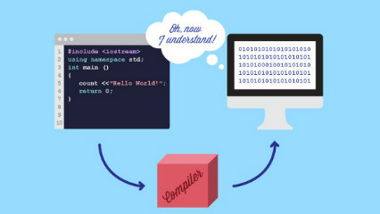

#### Java以及编程语言
&ensp;&ensp;&ensp;&ensp;狭义上说，java是一门计算机编程语言。这句话包含两个要点：
&ensp;&ensp;&ensp;&ensp;1. java是一门语言，这种语言可以被人类识别、书写；
&ensp;&ensp;&ensp;&ensp;2. 这门语言最终要应用到计算机。
&ensp;&ensp;&ensp;&ensp;关于第一点，java这门语言有着自己特殊的语法，非专业的人也许能看懂每个单词，但是单词连成一句话就不理解了，这需要训练；关于第二点，大家都知道计算机只认识0和1，不认识人类的语言，那么java程序从自然语言到最终执行，中间肯定需要经过一系列的转换，由自然语言转换成机器语言，这个过程一般叫做编译。

<!-- more -->
&ensp;&ensp;&ensp;&ensp;实际上，编译是一个逆过程，是计算机编程语言发展到高级阶段才出现的产物。在计算机最初被发明的年代，工程师们真的是手写0和1来给计算机下达指令的，那时候用打孔纸带作为存储指令的介质，纸带上某个位置有孔和无孔代表0和1。运算就是计算机将纸带吞入再吐出的过程，大概是下图这样子：

&ensp;&ensp;&ensp;&ensp;可以想象到那时计算机能做的事多么有限，以及手动写指令是多么麻烦。发展到电子阶段，虽然不用再给纸带打孔来保存指令了，但是手写一堆0和1组合，并且记住每个组合代表什么指令仍然是一件蛋疼的事，于是汇编语言出现了：给每个01组合所代表的指令起一个名字，人类可以看懂的名字，然后程序只需要保存这些名字即可，这就是所谓的源代码。

&ensp;&ensp;&ensp;&ensp;计算机真正需要执行程序的时候，再让机器把名字翻译成0和1组合就行了，这就是编译。汇编语言是低级语言，而java是高级语言，不过就编译而言，本质上是一样的。

#### Java的编译与执行
&ensp;&ensp;&ensp;&ensp;Java的源代码保存在以.java为后缀的文件中，java的字节码保存在以.class为后缀的文件中。从工程的角度，java的编译过程是把.java文件变成.class文件，即java源代码转换成java字节码。 字节码文件可以说是java程序的最终形态或者可执行文件，虽然同样是二进制文件，但是class文件与传统的可执行文件还是不同的：传统的可执行文件，比如由c/c++编写的程序，可以由操作系统直接执行；但是class文件只能由java虚拟机来执行，不能由操作系统直接执行，这里操作系统可以理解为计算机本身。

&ensp;&ensp;&ensp;&ensp;如上图，java字节码是由java虚拟机（JVM)来执行的，JVM是运行在操作系统上的一个普通程序。整个java技术体系，不仅仅包括狭义的java语言，还包括java编译器，虚拟机，开发工具，类库等。前者是java的核心和灵魂，后者就是支撑灵魂的身体。

#### 一次编写，到处执行
&ensp;&ensp;&ensp;&ensp;其实，java虚拟机也是一个程序，并且源码一般也是由c/c++编写的。那么java为什么要这么设计呢？java推广的时候有一个著名的口号：一次编写，到处运行。其实这句话准确的理解应该是“一次编译，到处运行”，也就是java的源代码被编译一次生成class文件后，这些class文件可以在任何安装了java虚拟机的机器上运行。
&ensp;&ensp;&ensp;&ensp;作为对比，传统的程序比如c/c++编写的程序，并不能“一次编译，到处运行”，同一套源代码在IBM的机器编译出来的可执行程序，到了惠普的机器上也许根本跑不动，必须要重新编译一次。其中的原因在于不同机器的硬件架构以及机器指令等底层设计都不一样，所以不同机器上的编译器也要做对应的调整，将源代码编译成不同的二进制指令。
&ensp;&ensp;&ensp;&ensp;而这显然是很麻烦的，想想吧，全世界有多少种不同的主流机器，c/c++的源代码就要编译多少个不同版本的可执行程序，而java拿到编译好的程序就可以执行，这种所谓跨平台的特性使其大受欢迎并迅速流行起来。不过呢，深究本质，java的虚拟机是要直接被机器执行的，所以虚拟机的源代码仍然是要被编译很多版本以适应不同的机器的，然而这件事由java的设计者操心就好了，使用java进行开发的人则完全不用关心，只需要在目标机器上安装好对应版本的虚拟机就可以进行开发了。
&ensp;&ensp;&ensp;&ensp;说穿了，java之所以能够“一次编写，到处运行”，是因为java设计者精心准备了java虚拟机这个东西，包揽了面对各种机器多次编译的脏活累活。Java虚拟机则屏蔽了不同机器的底层细节，让所有的机器对java开发者来说都是一样的。从上面的叙述中可以看出，java虚拟机，即JVM，对于java语言来说是至关重要的。